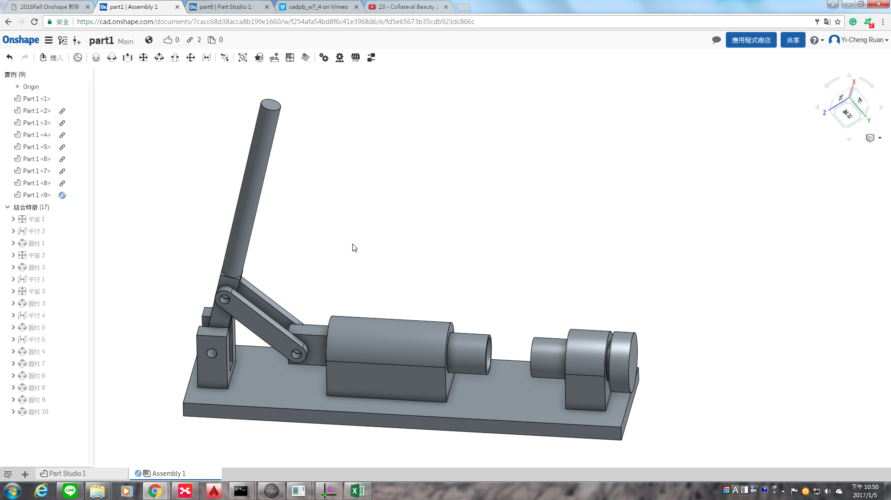

Title: 2016Fall cadp hw SolveSpace&Onshape範例圖檔
Date: 2016-09-2 12:00
Category: Misc
Tags: 使用導引
Author: yen

<!-- PELICAN_END_SUMMARY -->
Onshape曲柄滑塊機構 範例圖檔繪製(一)
<iframe src="https://player.vimeo.com/video/198291307" width="640" height="347" frameborder="0" webkitallowfullscreen mozallowfullscreen allowfullscreen></iframe> 
<a href="https://vimeo.com/198291307">2017-01-05 23-10-18</a> from <a href="https://vimeo.com/user61170413">40423217</a> on <a href="https://vimeo.com">Vimeo</a>.

Onshape曲柄滑塊機構 範例圖檔繪製(二)
<iframe src="https://player.vimeo.com/video/198291260" width="640" height="347" frameborder="0" webkitallowfullscreen mozallowfullscreen allowfullscreen></iframe> 
<a href="https://vimeo.com/198291260">2017-01-05 23-02-47</a> from <a href="https://vimeo.com/user61170413">40423217</a> on <a href="https://vimeo.com">Vimeo</a>.

利用Onshape進行繪製，可以承襲過去使用SolidWorks的經驗和技巧去操作。在2D平面繪製時不算棘手，最卡關的步驟是在進行"版本建置"以及"零件組立"，因為在組立所給予的對應約束條件，被從原先熟悉的項目在做細分，所以在初初接觸時很棘手，沒辦法順利進行組立。操作幾次後漸漸的熟悉縮相對應的條件，以及其在做配合時的條件約束方式；是以最簡條件進行。整體上來說，Onshape在零件繪製、組立以及版本建置，熟悉操作後可以快速進行作業。

SolveSpace在進行2D平面機構、3D單一零件繪製以及固定結構組立，操作上沒有問題，但是在進行機構組立時，很可能是因為軟體本身為最核心的基礎架構，所以有些相對約束可能過於複雜超出其運算範圍，以致常常在組立時出現錯誤。在搖桿以及浮桿進行組立時問題最大，最容易因為搖桿和平台，和搖桿和浮桿連接處，進行約束出現錯誤。

SolveSpace曲柄滑塊機構 範例圖檔
<iframe src="../data/SolveSpace_part2_fall.html" width="800" height="600" ></iframe>

<iframe src="../data/SolveSpace_part2_d1.html" width="800" height="600" ></iframe>

<iframe src="../data/SolveSpace_part2_d2.html" width="800" height="600" ></iframe>

<iframe src="../data/SolveSpace_part2_d3.html" width="800" height="600" ></iframe>

<iframe src="../data/SolveSpace_part2_d4.html" width="800" height="600" ></iframe>

<iframe src="../data/SolveSpace_part2_d5.html" width="800" height="600" ></iframe>

<iframe src="../data/SolveSpace_part2_d6.html" width="800" height="600" ></iframe>

<iframe src="../data/SolveSpace_part2_d7.html" width="800" height="600" ></iframe>

<iframe src="../data/SolveSpace_part2_d8.html" width="800" height="600" ></iframe>